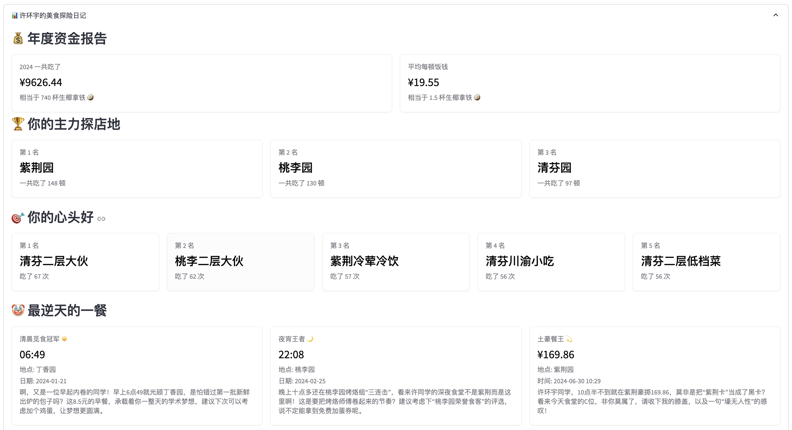
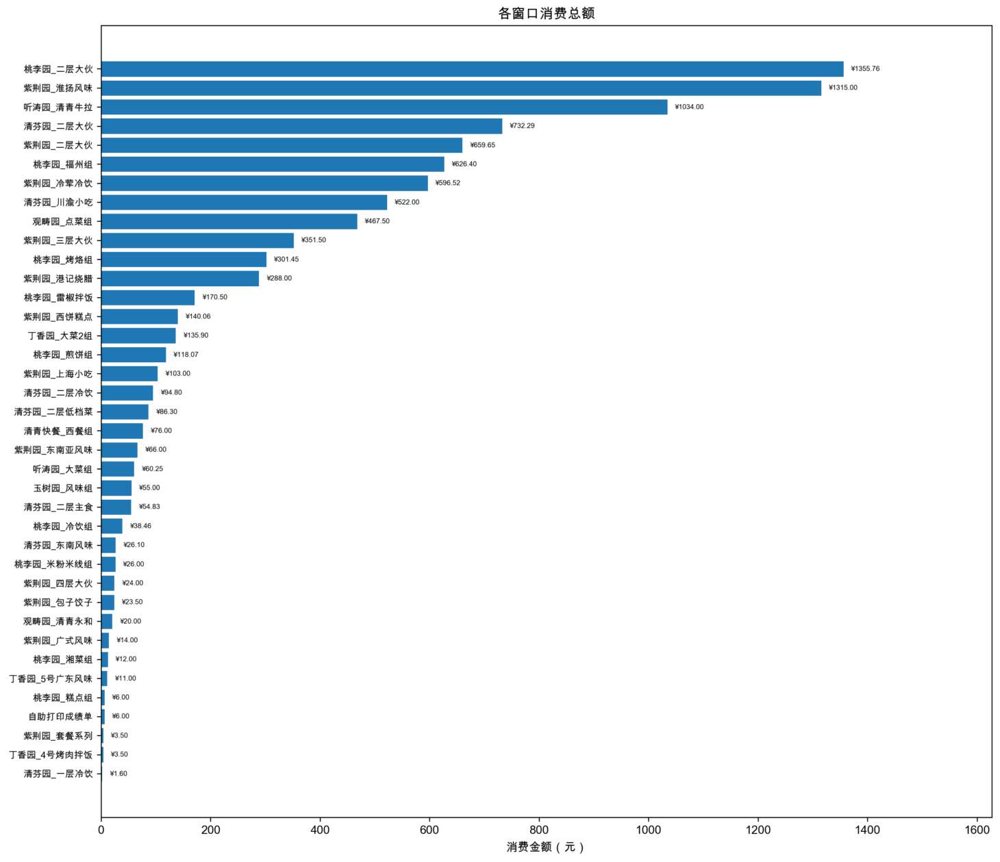

# THU-2024-Food

一年过去了，你在华子食堂里花的钱都花在哪儿了？

## 项目简介

> 本项目 Fork 自 [leverimmy/THU-Annual-Eat](https://github.com/leverimmy/THU-Annual-Eat)。部署了 SaaS 在线版本，并加入了详细的分析。

本项目是一个用于统计华清大学学生在食堂（和宿舍）的消费情况的可视化工具。通过模拟登录华清大学校园卡网站，获取学生在华子食堂的消费记录，并通过数据可视化的方式展示。




## 在线访问 👉 [https://thu2024.food](https://thu2024.food)

> 注意，本项目不保存任何个人隐私信息，在使用前需要自行登录华清大学校园卡网站，获取服务代码。

### 获取服务代码

首先，登录校园卡账号后，在[华清大学校园卡网站](https://card.tsinghua.edu.cn/userselftrade)获取你的服务代码。


`F12` 打开开发者工具，切换到 Network（网络）标签页，然后 `Ctrl + R` 刷新页面，找到 `userselftrade` 这个请求，查看标头中的 `Cookie` 字段，其中包含了你的服务代码。

服务代码是 `servicehall=` **之后**的一串字符（不含 `servicehall=`），复制下来即可使用。


## 本地部署

你可以选择以下两种方式部署本项目：

### 方式一：使用 Conda

1. 下载源码
2. 创建并激活 conda 环境：
```bash
conda create -n thueat python=3.10.0
conda activate thueat
```

3. 安装依赖：
```bash
pip install -r requirements.txt
```

4. 配置环境变量：
```bash
cp .env.example .env
```
编辑 `.env` 文件，填入必要的 API 信息

5. 运行应用：
```bash
streamlit run st.py
```

### 方式二：使用 Docker

1. 下载源码

2. 构建并运行：
```bash
docker build -t thu2024-food .
docker run -p 3000:3000 --env-file .env thu2024-food
```

3. 设置环境变量：
```bash
cp .env.example .env
```
编辑 `.env` 文件，填入必要的 API 信息

4. 访问 http://localhost:3000 即可使用。

## LICENSE

除非另有说明，本仓库的内容采用 [CC BY-NC-SA 4.0](https://creativecommons.org/licenses/by-nc-sa/4.0/) 许可协议。在遵守许可协议的前提下，您可以自由地分享、修改本文档的内容，但不得用于商业目的。